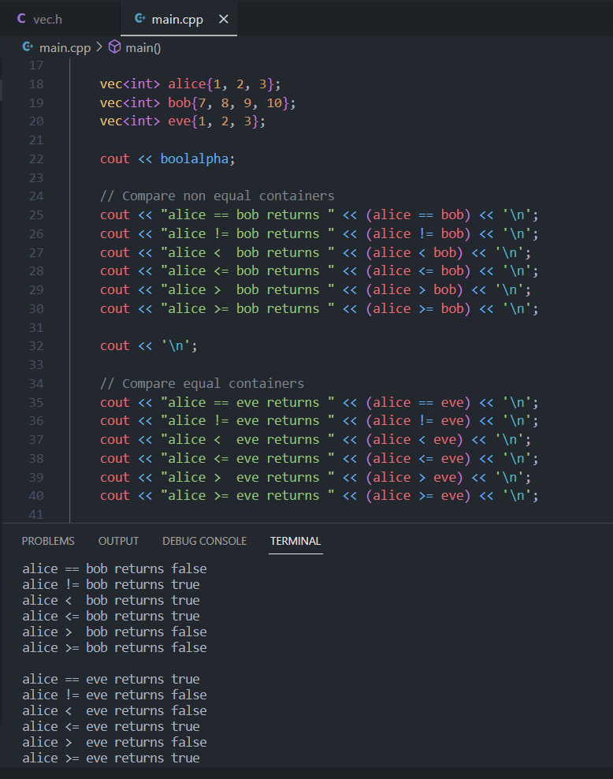

# vec

#### 1. Atkartoti pavyzdžiai pateikti std::vector konteinerio funkcijoms, gaunami tie patys rezultatai ir naudojant klasę "vec".
Lyginimo operatorių testo pavyzdys naudojant "vec" klasę:

#### 2. Spartos analizė.
|             |  vector  |    vec   |
|:-----------:|:--------:|:--------:|
|      10 000 | 0.000149 | 0.000212 |
|     100 000 | 0.001264 | 0.001389 |
|   1 000 000 | 0.011371 | 0.012603 |
|  10 000 000 | 0.120841 | 0.135414 |
| 100 000 000 | 1.092380 | 1.226640 |

Tradicinis vector konteineris veikė greičiau.

#### 3. Užpildant 100000000 elementų dydžio konteinerį ir vector, ir vec atminties perskistymas vyko 27 kartus.

#### 4. Spartos analizė naudojant vec praeitų užduočių programoje, apdorojant failą su 100 000 įrašų.
|        100 000        | vector |  vec  |
|:---------------------:|:------:|:-----:|
|       Failo skaitymas |  0.358 | 0.556 |
|      Įrašų rikiavimas |  0.258 | 0.369 |
| Rušiavimas į 2 grupes |  0.054 | 0.087 |
|        Bendras laikas |  1.040 | 1.516 |

Tradicinis vector konteineris šiuo atveju taip pat veikė greičiau.
